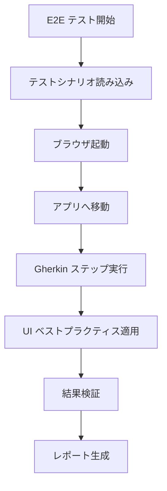

# Chrome DevTools E2E テストサンプル

Chrome DevTools MCP (Model Context Protocol) とGherkinシナリオを使用したAI駆動E2Eテストのデモリポジトリです。

> **📖 記事用サンプルリポジトリ**
> このリポジトリは、AI駆動E2Eテストの実装方法を解説する技術記事のために作成されたサンプルプロジェクトです。実際のプロダクション環境での使用例として参照できます。

## 🎯 概要

このプロジェクトは、以下を組み合わせた包括的なE2Eテストフレームワークの構築方法を紹介します：
- **Chrome DevTools MCP**: Model Context Protocolを通じたブラウザ自動化
- **Gherkinシナリオ**: 人間が読めるテスト仕様書
- **AI テスト実行**: テストの自動解釈と実行
- **Next.js サンプルアプリ**: テスト用デモeコマースアプリケーション

## 🏗️ プロジェクト構成

```
chrome-devtools-e2e-sample/
├── src/app/                    # Next.js アプリケーション
│   ├── auth/login/            # 認証ページ
│   ├── products/              # 商品カタログ
│   ├── admin/                 # 管理者パネル
│   └── users/[id]/            # ユーザー管理
├── docs/e2e-testing/          # E2E テストフレームワーク
│   ├── e2e-chrome-dev-tools-jp.md # メインテストガイド
│   ├── features/              # Gherkin テストシナリオ
│   │   ├── ユーザー認証.feature
│   │   ├── 商品検索とフィルタリング.feature
│   │   ├── 管理者ユーザー管理.feature
│   │   ├── ショッピングカート管理.feature
│   │   └── UI操作ベストプラクティス.feature
│   └── scenarios/             # 実行可能シナリオ
│       ├── 完全ショッピングフロー.feature
│       ├── 管理者ワークフロー.feature
│       └── UI操作信頼性テスト.feature
├── .claude/commands/          # Claude Code 統合
├── .mcp.json                  # MCP サーバー設定
└── README.md
```

## 🚀 クイックスタート

### 1. インストール

```bash
# リポジトリをクローン
git clone https://github.com/emrum01/chrome-devtools-e2e-sample.git
cd chrome-devtools-e2e-sample

# 依存関係をインストール
pnpm install

# 開発サーバーを起動
pnpm dev
```

### 2. MCP セットアップ

Claude Code（または互換性のあるMCPクライアント）がインストールされ、Chrome DevTools MCPで設定されていることを確認してください：

```json
{
  "mcpServers": {
    "chrome-devtools": {
      "command": "npx",
      "args": ["-y", "chrome-devtools-mcp", "--isolated"]
    }
  }
}
```

### 3. E2E テストの実行

Claude Code を使用：
```
/e2e-testing ユーザー認証と商品検索をテストしてください
```

## 📋 利用可能なテストシナリオ

| テストシナリオ | 説明 | フィーチャーファイル |
|---------------|-------------|--------------|
| **ユーザー認証** | ログインプロセスとセッション管理 | `ユーザー認証.feature` |
| **商品検索** | 検索とフィルター機能 | `商品検索とフィルタリング.feature` |
| **管理者ユーザー管理** | 役割変更とユーザー管理 | `管理者ユーザー管理.feature` |
| **ショッピングカート** | カート追加とカート管理 | `ショッピングカート管理.feature` |
| **UI ベストプラクティス** | 実証済みUI自動化パターン | `UI操作ベストプラクティス.feature` |

### 実行可能シナリオ

| シナリオ | 説明 | 実行内容 |
|---------|-------------|----------|
| **完全ショッピングフロー** | eコマース全体のユーザージャーニー | 認証→検索→カート追加 |
| **管理者ワークフロー** | 管理者機能の完全なテスト | 管理者認証→ユーザー管理→役割・ステータス変更 |
| **UI操作信頼性テスト** | UI操作パターンの信頼性検証 | ドロップダウン→動的フォーム→ダイアログ処理 |

## 🎮 サンプルアプリケーションの機能

### ユーザーインターフェース
- **ホームページ**: 各アプリセクションへのナビゲーション
- **ログインページ**: テストアカウント付きメール/パスワード認証
- **商品カタログ**: 検索・フィルター機能付き商品一覧
- **ショッピングカート**: 商品追加/削除機能

### 管理者インターフェース
- **ユーザー管理**: ユーザーアカウントの表示、編集、管理
- **役割管理**: ユーザー役割と権限の変更
- **注文管理**: 顧客の注文と状況の表示

### テストアカウント
```
顧客:    test@example.com / password123
管理者:  admin@example.com / admin123
マネージャー: manager@example.com / manager123
```

## 🔧 E2E テストフレームワーク

### コアコンポーネント

1. **メインテストガイド** (`docs/e2e-testing/e2e-chrome-dev-tools-jp.md`)
   - 実行手順とベストプラクティス
   - 環境設定
   - エラーハンドリング戦略

2. **Gherkin フィーチャー** (`docs/e2e-testing/features/`)
   - 振る舞い駆動テスト仕様
   - 再利用可能なテストシナリオ
   - UI操作パターン

3. **実行可能シナリオ** (`docs/e2e-testing/scenarios/`)
   - 複数フィーチャーを統合した完全なワークフロー
   - フロントマター設定によるテストチェーン
   - 引数とアウトプットの管理

4. **MCP 統合** (`.mcp.json`)
   - Chrome DevTools サーバー設定
   - テスト用分離ブラウザインスタンス

### テストワークフロー



## 🛠️ UI ベストプラクティス

フレームワークには以下の実証済みパターンが含まれています：
- **ドロップダウン操作**: 信頼性の高いselect要素操作
- **動的フォーム**: 複数ステップフォームハンドリング
- **ページ遷移**: 適切な待機戦略
- **エラーハンドリング**: 優雅な失敗管理
- **状態検証**: 成功/エラー確認

ドロップダウン操作パターンの例：
```javascript
const selects = document.querySelectorAll('select');
const comboboxes = document.querySelectorAll('[role="combobox"]');
const allSelects = [...selects, ...comboboxes];

allSelects.forEach((element) => {
  const options = element.querySelectorAll('option');
  const parentText = element.parentElement?.textContent || '';

  options.forEach(option => {
    if (option.textContent.includes('対象値')) {
      element.value = option.value;
      element.selectedIndex = option.index;
      element.dispatchEvent(new Event('change', {bubbles: true}));
      element.dispatchEvent(new Event('input', {bubbles: true}));
    }
  });
});
```

## 🎯 使用例

### 基本認証テスト
```
/e2e-testing ユーザーログイン検証

# AIが実行する内容:
# 1. docs/e2e-testing/features/ユーザー認証.feature
# 2. ログインページへ移動
# 3. テスト認証情報入力
# 4. 認証成功の検証
```

### 管理者ワークフローテスト
```
/e2e-testing 管理者ユーザー役割管理

# AIが実行する内容:
# 1. 管理者ログイン認証
# 2. docs/e2e-testing/features/管理者ユーザー管理.feature
# 3. ユーザー管理へ移動
# 4. ユーザー役割変更と検証
```

### 完全eコマースフロー
```
/e2e-testing 完全ショッピング体験

# AIが複数のフィーチャーファイルを実行:
# 1. ユーザー認証.feature (ログイン)
# 2. 商品検索とフィルタリング.feature (商品検索)
# 3. ショッピングカート管理.feature (カート追加)
# 4. エンドツーエンド機能検証
```

## 🌍 環境サポート

| 環境 | URL | 説明 |
|-------------|-----|-------------|
| ローカル | http://localhost:3004 | 開発環境 |
| 開発 | https://dev.example.com | 開発デプロイ |
| ステージング | https://staging.example.com | 本番前テスト |

## 📊 主な利点

1. **AI駆動テスト**: 自然言語でのテスト実行
2. **人間が読める仕様**: 明確なテストドキュメントのためのGherkinシナリオ
3. **再利用可能パターン**: 信頼性の高い自動化のためのUIベストプラクティス
4. **包括的カバレッジ**: エンドツーエンドワークフローテスト
5. **簡単な統合**: Claude CodeとMCPエコシステムとの連携

## 🎨 フロントマター設定

各フィーチャーファイルには、テストの実行と連携を管理するYAMLフロントマターが含まれています：

```yaml
---
arguments:
  test_email: string = "test@example.com"
  test_password: string = "password123"
output:
  user_session: boolean
  authenticated_user: string
next_steps:
  docs/e2e-testing/features/商品検索とフィルタリング.feature@商品検索基本
---
```

## 🤝 コントリビューション

これは教育目的のサンプルリポジトリです。自由にフォークして、自分のプロジェクトに適応させてください。

## 📄 ライセンス

MIT License - 詳細は [LICENSE](LICENSE) ファイルをご覧ください。

## 🔗 関連リソース

- [Chrome DevTools MCP](https://github.com/rusiaaman/chrome-devtools-mcp)
- [Claude Code ドキュメント](https://claude.ai/code)
- [Model Context Protocol](https://modelcontextprotocol.io/)
- [Gherkin リファレンス](https://cucumber.io/docs/gherkin/)

---

**AIテストコミュニティのために ❤️ を込めて作成**