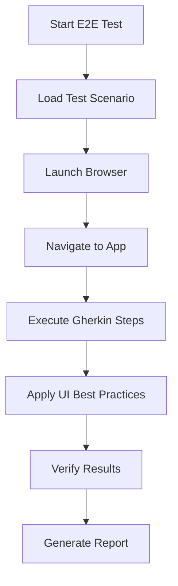

# Chrome DevTools E2E Testing Sample

A sample repository demonstrating AI-powered E2E testing using Chrome DevTools MCP (Model Context Protocol) with Gherkin scenarios.

## 🎯 Overview

This project showcases how to create a comprehensive E2E testing framework that combines:
- **Chrome DevTools MCP**: Browser automation via Model Context Protocol
- **Gherkin Scenarios**: Human-readable test specifications
- **AI Test Execution**: Automated test interpretation and execution
- **Next.js Sample App**: Demo e-commerce application for testing

## 🏗️ Project Structure

```
chrome-devtools-e2e-sample/
├── src/app/                    # Next.js application
│   ├── auth/login/            # Authentication pages
│   ├── products/              # Product catalog
│   ├── admin/                 # Admin panel
│   └── users/[id]/            # User management
├── docs/e2e-testing/          # E2E testing framework
│   ├── e2e-chrome-dev-tools.md # Main testing guide
│   └── features/              # Gherkin test scenarios
│       ├── user-authentication.feature
│       ├── product-search.feature
│       ├── admin-user-management.feature
│       ├── shopping-cart.feature
│       └── ui-best-practices.feature
├── .claude/commands/          # Claude Code integration
├── .mcp.json                  # MCP server configuration
└── README.md
```

## 🚀 Quick Start

### 1. Installation

```bash
# Clone the repository
git clone https://github.com/emrum01/chrome-devtools-e2e-sample.git
cd chrome-devtools-e2e-sample

# Install dependencies
pnpm install

# Start the development server
pnpm dev
```

### 2. MCP Setup

Make sure you have Claude Code (or compatible MCP client) installed and configured with Chrome DevTools MCP:

```json
{
  "mcpServers": {
    "chrome-devtools": {
      "command": "npx",
      "args": ["-y", "chrome-devtools-mcp", "--isolated"]
    }
  }
}
```

### 3. Run E2E Tests

Using Claude Code:
```
/e2e-testing user authentication and product search
```

## 📋 Available Test Scenarios

| Test Scenario | Description | Feature File |
|---------------|-------------|--------------|
| **User Authentication** | Login processes and session management | `user-authentication.feature` |
| **Product Search** | Search and filter functionality | `product-search.feature` |
| **Admin User Management** | Role changes and user administration | `admin-user-management.feature` |
| **Shopping Cart** | Add to cart and cart management | `shopping-cart.feature` |
| **UI Best Practices** | Proven UI automation patterns | `ui-best-practices.feature` |

## 🎮 Sample Application Features

### User Interface
- **Home Page**: Navigation to different app sections
- **Login Page**: Email/password authentication with test accounts
- **Product Catalog**: Searchable and filterable product listing
- **Shopping Cart**: Add/remove products functionality

### Admin Interface
- **User Management**: View, edit, and manage user accounts
- **Role Management**: Change user roles and permissions
- **Order Management**: View customer orders and status

### Test Accounts
```
Customer: test@example.com / password123
Admin:    admin@example.com / admin123
Manager:  manager@example.com / manager123
```

## 🔧 E2E Testing Framework

### Core Components

1. **Main Test Guide** (`docs/e2e-testing/e2e-chrome-dev-tools.md`)
   - Execution procedures and best practices
   - Environment configuration
   - Error handling strategies

2. **Gherkin Features** (`docs/e2e-testing/features/`)
   - Behavior-driven test specifications
   - Reusable test scenarios
   - UI operation patterns

3. **MCP Integration** (`.mcp.json`)
   - Chrome DevTools server configuration
   - Isolated browser instances for testing

### Testing Workflow



## 🛠️ UI Best Practices

The framework includes proven patterns for:
- **Dropdown Operations**: Reliable select element manipulation
- **Dynamic Forms**: Multi-step form handling
- **Page Transitions**: Proper wait strategies
- **Error Handling**: Graceful failure management
- **State Verification**: Success/error confirmation

Example dropdown operation pattern:
```javascript
const selects = document.querySelectorAll('select');
const comboboxes = document.querySelectorAll('[role="combobox"]');
const allSelects = [...selects, ...comboboxes];

allSelects.forEach((element) => {
  const options = element.querySelectorAll('option');
  options.forEach(option => {
    if (option.textContent.includes('Target Value')) {
      element.value = option.value;
      element.selectedIndex = option.index;
      element.dispatchEvent(new Event('change', {bubbles: true}));
      element.dispatchEvent(new Event('input', {bubbles: true}));
    }
  });
});
```

## 🎯 Usage Examples

### Basic Authentication Test
```
/e2e-testing user login verification

# AI will execute:
# 1. docs/e2e-testing/features/user-authentication.feature
# 2. Navigate to login page
# 3. Enter test credentials
# 4. Verify successful authentication
```

### Admin Workflow Test
```
/e2e-testing admin user role management

# AI will execute:
# 1. Admin login authentication
# 2. docs/e2e-testing/features/admin-user-management.feature
# 3. Navigate to user management
# 4. Change user roles and verify
```

### Complete E-commerce Flow
```
/e2e-testing full shopping experience

# AI will execute multiple feature files:
# 1. user-authentication.feature (login)
# 2. product-search.feature (find products)
# 3. shopping-cart.feature (add to cart)
# 4. Verify end-to-end functionality
```

## 🌍 Environment Support

| Environment | URL | Description |
|-------------|-----|-------------|
| Local | http://localhost:3000 | Development environment |
| Dev | https://dev.example.com | Development deployment |
| Staging | https://staging.example.com | Pre-production testing |

## 📊 Key Benefits

1. **AI-Powered Testing**: Natural language test execution
2. **Human-Readable Specs**: Gherkin scenarios for clear test documentation
3. **Reusable Patterns**: UI best practices for reliable automation
4. **Comprehensive Coverage**: End-to-end workflow testing
5. **Easy Integration**: Works with Claude Code and MCP ecosystem

## 🤝 Contributing

This is a sample repository for educational purposes. Feel free to fork and adapt for your own projects.

## 📄 License

MIT License - see the [LICENSE](LICENSE) file for details.

## 🔗 Related Resources

- [Chrome DevTools MCP](https://github.com/rusiaaman/chrome-devtools-mcp)
- [Claude Code Documentation](https://claude.ai/code)
- [Model Context Protocol](https://modelcontextprotocol.io/)
- [Gherkin Reference](https://cucumber.io/docs/gherkin/)

---

**Made with ❤️ for the AI testing community**
